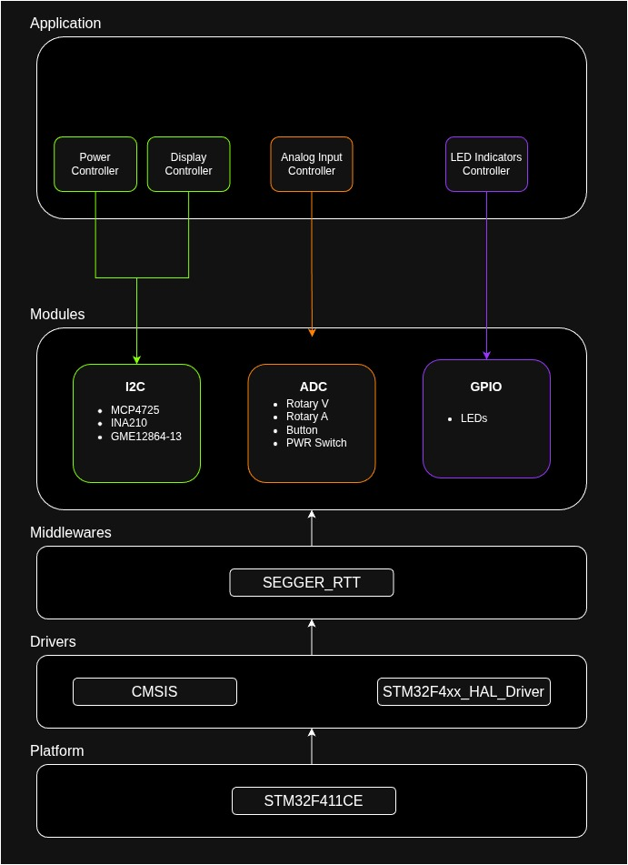

# Variable Digital Power Supply

A digitally controlled variable bench power supply unit with fixed and variable output channels, PID secured accuracy, safety controls for temperature, voltage, and current, and programmable presets for the variable channel.

*This document is subject to change as I continue to work on the project and make adjustments through iterative design.*

## Post-Phase Write-ups

I would consider there to be 3 major "phases" of this project, of which I have/will be creating a write-up for each to reflect on the challenges I faced, evaluate the solutions I used, and overarching lessons about embedded systems development.

1. [Discovery Phase](./docs/writeup/discovery.md)
2. [Hardware Phase](./docs/writeup/hardware.md)
3. Software Phase (currently in progress)

## Inspiration

This project was inspired by two main factors:

1. I need a reliable power supply for testing and building embedded applications
2. I had a couple spare old laptop charging bricks: 20V 2.25A and 20V 3.25A

Designing and building my own tools seemed like a great way to learn since the scope of what I can achieve is limited by the tools I have access to and any future project's quality is dependant on the accuracy and completeness of those tools.

## Planned Features

- Variable output channel: 2V to 12V
- Fixed 3V3 output channel
- Fixed 5V output channel
- OLED display: simple UI for readings or functionality selection
- LEDs for status indicators: on/off for master power, error codes for debugging, and on/off state for output channels
- Software based safety controls for automatic shutoffs
- PI control for variable output to ensure accuracy and consistency
- Programmable presets for variable output

## Development Process

### Discovery

I would consider this the first "real" and comprehensive project I am taking on as opposed to isolated implementations of circuits and protocols. Given the requirements for a complete system, I had to spend time figuring out approaches and gaining knowledge and skills to move into prototyping.

This included:

- Basics such as wire, module, and feature selection
- Learning to solder
- Understanding limitations of the selected modules and overcoming those limitations to satisfy feature requirements (more on this in Prototype Materials)

### Prototyping

Having uncovered most of the challenges I would face from making design decisions with limited knowledge at the time (aka poor choices,) I began assmbling circuits starting with the laptop charger to LM2596 buck converters. Once I was satisfied, I moved on to the next logical steps and continued this process.

*Currently still in the prototyping phase*

### PCB and Enclosure Design

Coming soon.

### QA and Revision

Depends on previous.

### Final Product

Depends on previous.

## Prototype Materials

In the current prototype state, there are 7 main components:

1. 1x STM32F411CE dev board
2. 2x LM2596 buck converter modules; 1 with manual adjustment via 10kΩ potentiometer
4. 1x AMS1117 3V3 1A LDO module
4. 1x INA219 currenr sensor module
5. 1x MCP4725 16bit DAC modules
6. 4x IRLZ44N MOSFETs
7. 1x GME12864-13 OLED display module

### STM32F411CE Dev Board

There was no specific analysis used for this selection. I just had some on hand.

### LM2596 Buck Converters

Selection was simply based on being cheap and available modules because I knew I would mess up at least one of them after discovering the earlier referenced limitation.

Since they adjust their output with a manual three pin 10kΩ pot, they are not immediately suitable for digital control. After doing research, I started with a method that involved desoldering the pot. The intention was to bypass the function of the manual pots entirely and directly access the feedback pin via DAC out. Due to discovering another potential method and my lack knowledge, I switched to a voltage injection approach which was simpler from the electrical engineering side. (I couldn't find a schematic for the modules I had and didn't fully understand how to recreate the required resistor network to replace the pot.)

The module already includes a two resistor divider; 330Ω to GND and the pot. To control the output of the buck via DAC, a third 1KΩ resistor was soldered directly to the pin of the pot corresponding to feedback and connected to DAC out. Since the DAC is 16 bit, it uses 0-4095 steps  (~0.002691V per step) to control the output. The out voltage is inverse to the DAC steps. I tuned the pot to 12V out with the at DAC out at 0V. This created a range of 12V to ~1.xxV, with a software clamp applied to limit the lower range to 3V3 (~3232 steps.)

The fixed outs were simple enough since it just required measuring with a multimeter and turning the pot screws until reaching 3V3 and 5V.

### AMS1117 3V3 1A LDO

Had these on hand and worked well enough to feed to 5V LM2596 into the 3V3 LDO for the 3V3 out channel

### INA219 Current Sensor

A very important component, the INA219 is what monitors and provides metrics for the output voltage and current, as well as data for the OLED display and intelligent decision to moderate operation.

### MCP4725 DAC

Since the dev board did not include a DAC, I needed an external one. This again was just a cheap option with very little in-depth analysis since this was all part of the learning process.

### IRLZ44N MOSFETs

Also incredibly important as these are the digital switches that respond to data from the INA219 in order to ensure safe output levels. The built-in safety shutoff in case current exceeds a defined threshold will switch the output channels off or master power if needed.

### GME12864-13 OLED display

Keeping with the theme, this was selected mainly as a cheap option for prototyping and learning purposes.

## Prototype Software Architecture

I'm still working out the software as I go. It's a mix of experimentation, design, and iteration.

