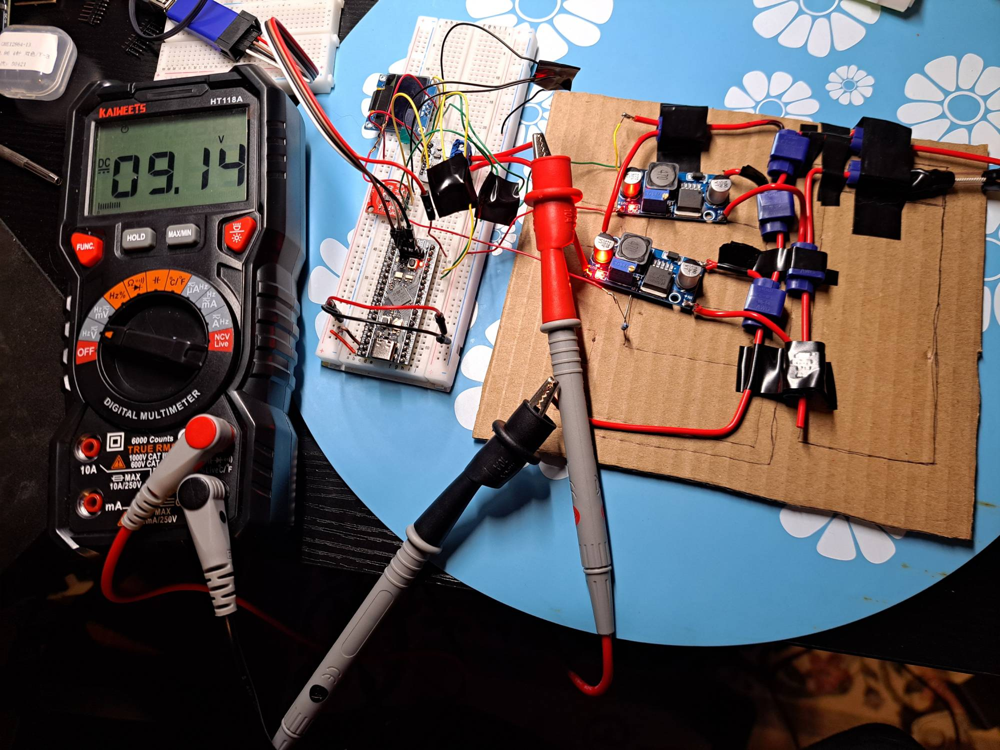
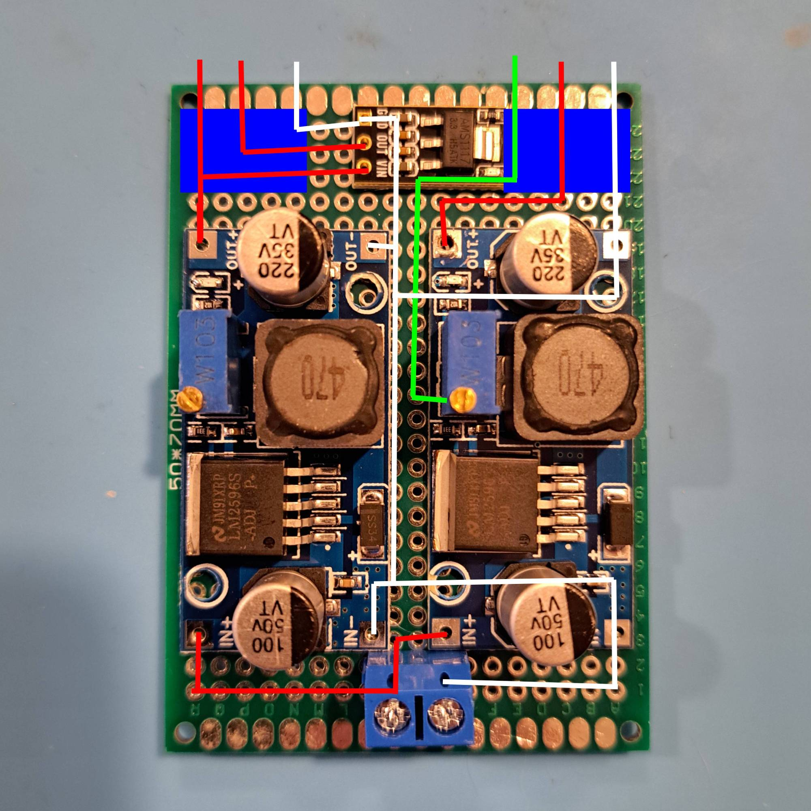
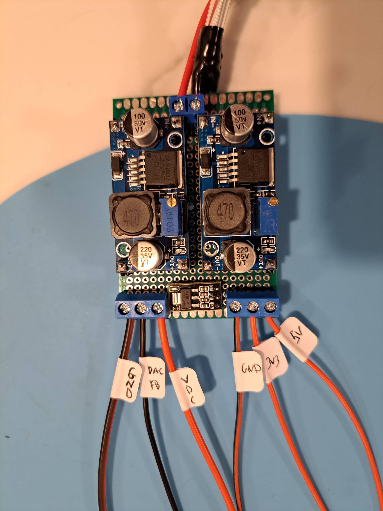

# Phase 2: Hardware

"I'll redo it just one more time and then I can finally move onto the firmware." — Me, many times.

## Iterative Learning

Perhaps rather naively at times, I tend to dive into things head-first. I think it's important to experience practical problems for myself to develop an understanding and appreciation for the how and why of established practices and approaches.

Having said that, hardware debugging and "board revision" is a special kind of hell, even though I had a lot of fun in the process. Between experimenting with different connectors, using many different prototyping materials, and figuring out the circuit is missing a component required to implement some sort of functionality, _I think I got the full entry DIY electronics experience._ 

I would say the key concepts I learned are:
- **Embrace Simplicity** where ever possible. There are plenty of complex problems to solve that require more complex solutions, so make life easier through reduction when the same (or better) result can be achieved.
- **The Right Tools** for the job is the difference between minutes and hours, cumulatively. The price is worth the time savings.
- **Research and Design Upfront**. Even though some things will only be uncovered through the building and testing process, a lot of headaches and revisions can be avoided by doing something as simple as laying out components on a PCB, taking a picture, and drawing wires on the picture.

### Embrace Simplicty

My example lesson for simplicity came from a realization about LEDs.

I wanted to have LEDs that indicate whether the power channel outputs are on or off. Coming from a software background, my first instinct was to handle it in my Power and LED controller logic. A button press would trigger an IRQ, setting flags for toggling the GPIOs, driving the corresponding channel's LED and output.

The purpose of the LED is to act as a UI for the state of the power channel, but they're also extremely helpful hardware debuggers. It's probably so obvious to anyone with more experience, but decoupling the LED control from the physical flow of power could lead to confusing issues where the LED is on but no power is making it to the connected load.

The solution? Tie the LEDs and resistors to test leads that plug into the power channel out jacks. No firmware required to control the LEDs, more GPIOs available for other functionality, and no guessing if the output is enabled AND the load is receiving power.

Ultimately, I still decided to go with using two different LEDs per channel, RGB on the PSU controlled by firmware for more detailed status indication and the single color tied to the test leads. But my invaluable realization is some solutions can be distilled down to simple analog or passive components which in turn reduces complexity while increasing accuracy and reliability.

### The Right Tools

I severely underestimated how much the right tool matters when it comes to electronics. Between having different connectors, tweezers meant for pick and placing small pieces, soldering iron tips and flux, perfboard PCBs; some things you can't really "make it work" with whatever you have laying around the house.

I lost plenty of time messing with stripping and soldering wires together and using things like quick connectors or butt splices before just ordering a bunch of connector assessories: different AWG wire strippers, crimpers, JSTs, Duponts, screw terminals, reels of stranded wire, etc... the struggle of trying to "make it work" taught me the price of tools and accessories is easily justified by the time and effort saved doing the tedious busy work of assembly. Especially with the time constraints I've been operating under.

<figure>
  
  <figcaption>One of my early prototype stages while figuring out the power control portion of the eventual circuit using sub-optimal tools and accessories.</figcaption>
</figure>

### Research and Design Upfront

There is **a lot** to be said about this point. I wouldn't change how I went about figuring out the hardware side of the project because without just jumping in, I wouldn't know what questions to ask or if the questions I had were relavant to making progress.

Getting started, I wanted to use components I had already accumulated and was mostly justfair                                                                                        ly indiscriminate in the specifics of others I picked out. I just simply didn't know enough to make an informed choice OR how to go about informing myself of what constitutes a good choice.1`

Besides the time lost on the monotonous aspects of putting a board together, I also desoldered and reworked my board at least 10 times. Half of this was the natural progression of working through getting sections of the circuit working with small tests and realizing there was a better configuration once the next block was added. The other part was just the lack of knowledge that would come from research and lack of direction that would come from design.

After I cultivated some sort of foundational knowledge and experience, as well as more complete picture in my mind of the overall design, I started laying components on a PCB, taking a picture, and then drawing connections on the image itself as a way to plan out routing. This exponentially reduced the assembly time since I had some sort of guideline to work with.

<figure>
  
  <figcaption>The quick and dirty way of planning out routing.</figcaption>
</figure>

<figure>
  
  <figcaption>Assembed board based on the hacky routing plan.</figcaption>
</figure>